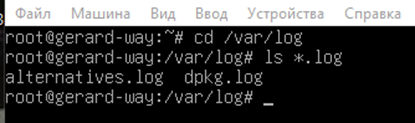
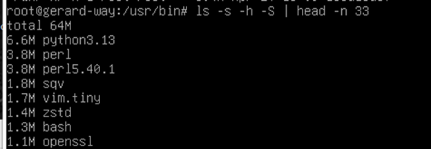
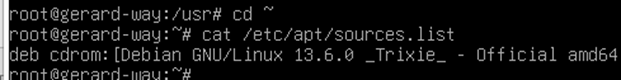
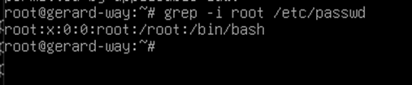
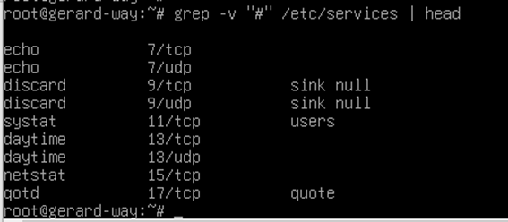
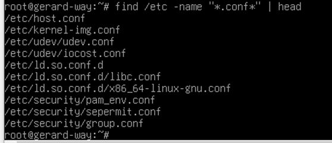
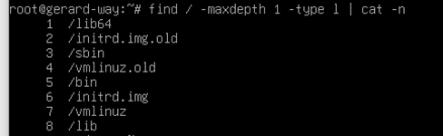
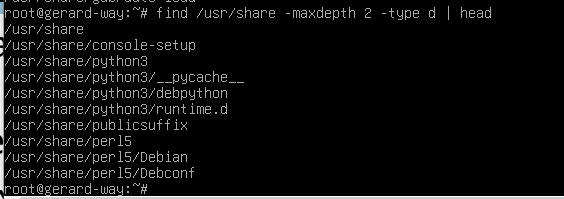
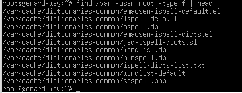
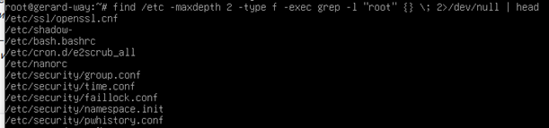

# ДОМАШНЕЕ ЗАДАНИЕ
## ПО ДИСЦИПЛИНЕ «ОПЕРАЦИОННЫЕ СИСТЕМЫ И СРЕДЫ»
### **Тема: «Использование простых команд»** 

>Практика по командам cd, ls, cat, grep, find

| | |
| :--- | :--- |
| Студент: | Станчинская София Антоновна |
| Группа: | 9/2-РПО-25/3 (РПО9-3) |
| Дата: | 20.09.2026 |
| Преподаватель: | Штейнберг Эмиль Эдуардович |

>так как я переделываю это задание, решила писать значения флагов и команд из https://man7.org/, чтобы окончательно запомнить все, что не помню, и если что опиратся на дз для повторения. Поэтому некоторые пометки могут показаться излишними, но мне нужны :]

## **Задание 1. <u>Простые команды</u>**

### **1.1.**

* ☼ Перейдите в каталог /var/log и покажите в нем все файлы с расширением .log.

  **`cd /var/log` переход в каталог /var/log**

  **`ls *.log` поиск всех файлов с расширением .log**
  ||||
  |:---|:---|:---|
  |`cd`| изменить рабочий каталог| cd [-L\|-P] [directory] |
  |`.`| текущая папка | /home/user/Documents |
  |`..`|родительская папка текущей (1 раз наверх по пути)| /home/user/|
  |`ls`| список содержимого каталога | ls [OPTION]... [FILE]...|

  
   
  <small><em>Рисунок 1. cd, ls</em></small>

### **1.2.**

* ☼ Перейдите в каталог /usr/bin. Покажите в нем все файлы в отсортированном по размеру порядке.

| | |
| :--- | :--- |
|ls `-s, --size` | выводит выделенный размер каждого файла в блоках |
|ls `-S` | сортирует по размеру файла, начиная с самых больших |
| `-h, --human-readable`| с опциями -l и -s выводит размеры в формате 1K, 234M, 2G и т. д. |
| `\|` | ковейер (pipeline) позволяет передавать вывод одной команды на вход другой команды
| `head` | выводит начальную часть файлов (по умолчанию 10 строк) |
|ls `-n, --lines=[-]NUM` |вывести первые NUM строк вместо первых 10; при указании символа «-» в начале вывести все строки каждого файла, кроме последних NUM |

 
<small><em>Рисунок 2. ls и его флаги</em></small>

### **1.3.**

* ☼ Отобразите содержимое файла /etc/apt/sources.list.

| | |
|:---|:---|
|`~`|домашняя папка текущего пользователя|
|`/`|корень системы, главный каталог|
|`cat`|объединяет (concatenate) файлы и выводит результат на стандартный вывод|

 
<small><em>Рисунок 3. cd, cat</em></small>

### **1.4.**

* ☼ В файле/etc/passwd найдите все строки, содержащие слово root.

| | |
|:---|:---|
|`grep`|(global regular expression print) поиск строк по шаблону, внутри файлов/выводов|
|grep `-i`|(ignore case) игнорировать регистр|

 
<small><em>Рисунок 4. grep, -i</em></small>

### **1.5.**

* ☼ В файле /etc/services выведите все строки, в которых нет комментариев (комментарии начинаются с символа #).

| | |
|:---|:---|
|grep `-v`|(invert) инвертировать поиск (все кроме шаблона)|

 
<small><em>Рисунок 5. grep, -i</em></small>

### **1.6.**

* ☼ Найдите все файлы и директории с расширением .conf или .conf.d в каталоге /etc (используйте одну команду).

| | |
|:---|:---|
|`find`| поиск файлов в иерархии каталогов find [-D debugopts] [starting-point...] [expression]|
|find `-name`| искать по имени|

 
<small><em>Рисунок 6. find, -name</em></small>

### **1.7.**

* ☼ Определите сколько в корневом каталоге объектов типа «ссылка» (подсказка: используйте find с типом файла l).

| | |
|:---|:---|
|find `-maxdepth`| максимальная глубина поиска|
|find `-type`| искать по типу (f-file, d-directory l-link)|
|cat `-n`|  -n, --number пронумеровать все выходные линии|

 
<small><em>Рисунок 7. find, -maxdepth, -type</em></small>

### **1.8.**

* ☼ Найдите в /usr/share все каталоги на глубине не более 2 уровней.

 
<small><em>Рисунок 8. find, -maxdepth, -type</em></small>

### **1.9.**

* ☼ Найдите в /var все файлы, принадлежащие пользователю root.

| | |
|:---|:---|
|find `-user`|поиск файлов, принадлежащих конкретному пользователю|

 
<small><em>Рисунок 9.  find, -user, -type</em></small>

### **1.10.**

* ☼ Найдите все файлы в /etc в пределах 2 каталогов, внутри которых упоминается пользователь root (используйте -exec с командой grep).

| | |
|:---|:---|
|`-exec` execute| `-exec [команда] {} \;` |
|`-exec`| execute (выполнить) "начало цикла" |
|`{}`| контейнер для значений, которые передает find |
|`\;`| ; - конец "цикла", \ - чтобы терминал не перехватывал|
|||
|`2>/dev/null`| ошибки (2) переправить (>) в "черную дыру" (/dev/null)|

 
<small><em>Рисунок 10. find, -exec, grep</em></small>

  ## **ВЫВОДЫ**

  **В процессе выполнения домашнего задания были изучены команды cd, ls, cat, grep, find. Благодаря им можно легко перемещаться по файловой системе, находить нужные файлы, каталоги, строки по их свойствам.**

