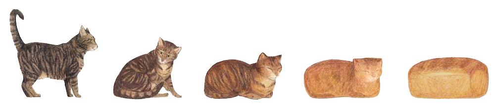
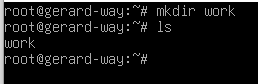
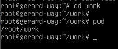
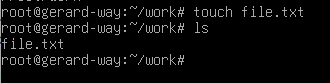
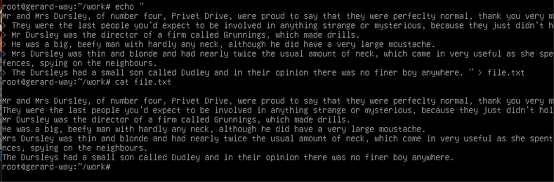
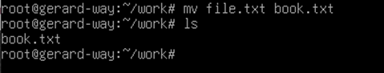
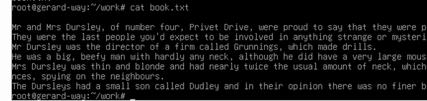
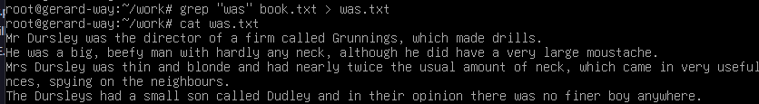
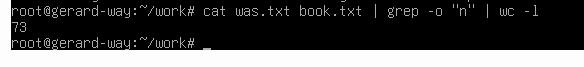

# ДОМАШНЕЕ ЗАДАНИЕ
## ПО ДИСЦИПЛИНЕ «ОПЕРАЦИОННЫЕ СИСТЕМЫ И СРЕДЫ»
### **Тема: «Использование простых команд 2»** 

>Практика по командам часть 2

| | |
| :--- | :--- |
| Студент: | Станчинская София Антоновна |
| Группа: | 9/2-РПО-25/3 (РПО9-3) |
| Дата: | 30.09.2026 (исправление удаленного) |
| Преподаватель: | Штейнберг Эмиль Эдуардович |

## **Задание 1. <u>Простые команды</u>**

### **1.1.**

* ☼ Создайте новый каталог work в домашней директории.

  ||||
  |:---|:---|:---|
  |`mkdir`| создание каталогов mkdir [ OPTION ]... DIRECTORY ... |

  
   
  <small><em>Рисунок 1. mkdir</em></small>

### **1.2.**

* ☼ Перейдите в созданный каталог. Выведите каталог, в котором вы находитесь.

| | |
| :--- | :--- |
|`pwd` | выводит имя текущего каталога pwd [OPTION]...|

 
<small><em>Рисунок 2. pwd</em></small>

### **1.3.**

* ☼ Создайте в нем с помощью команды touch пустой файл file.txt.

| | |
|:---|:---|
|`touch`|создать файл или изменить метку времени файла touch [OPTION]... FILE...|

 
<small><em>Рисунок 3. touch</em></small>

### **1.4.**

* ☼ С помощью команды echo заполните файл текстом. Для выполнения задания возьмите первые два абзаца из текста книги «Гарри Поттер и философский камень». Записывайте каждое предложение с новой строки.

| | |
|:---|:---|
|`echo`|отобразить строку текста|

 
<small><em>Рисунок 4. echo</em></small>

### **1.5.**

* ☼ Переименуйте файл в book.txt.

| | |
|:---|:---|
|`mv`|перемещение (переименование) файлов|

 
<small><em>Рисунок 5. mv</em></small>

### **1.6.**

* ☼ Прочитайте файл и убедитесь, что все предложения вставлены корректно.

Yes...yes, it's correct. (Исправлено, теперь с апострофом)

 
<small><em>Рисунок 6. cat</em></small>

### **1.7.**

* ☼ Найдите все предложения в файле, которые содержат слово was. Результат запишите в новый файл was.txt.

| | |
|:---|:---|
|`>`| перенаправление стандартного потока вывода|

>убран излишний флаг -i (игнорирование регистра)

 
<small><em>Рисунок 7. grep, > </em></small>

### **1.8.**

* ☼ Объедините файлы was.txt и book.txt. С помощью команды wc посчитайте, сколько раз в них встречается буква n (используйте команду grep и справку).

| | |
|:---|:---|
|`wc`| выводит количество символов новой строки, слов и байтов для каждого файла |
|wc `-l`| -l, --lines выводит количество переносов строк|
|grep `-o`|-o , --only-matching выводит только совпадающие (непустые) части совпадения|

<small><em>Рисунок 8. cat, wc, grep</em></small>

  ## **ВЫВОДЫ**

  **В процессе выполнения домашнего задания были изучены команды `mkdir`, `pwd`, `touch`, `echo`, `mv`, `wc`, а также `>` и `|` . Благодаря им можно работать с файлами, создавать, изменять их содержимое и переименовывать. Эти команды пригодятся для поиска ошибок в логах и быстрой фильтрации больших объемов текстовых данных**

