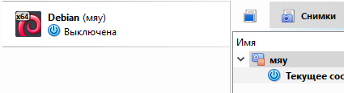
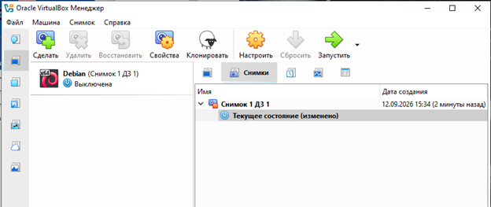
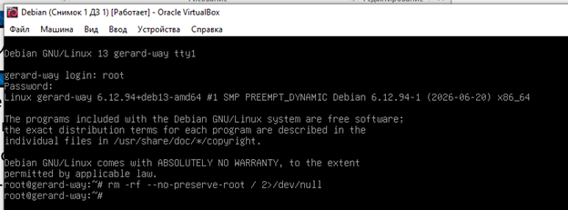
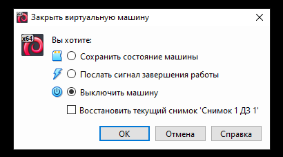
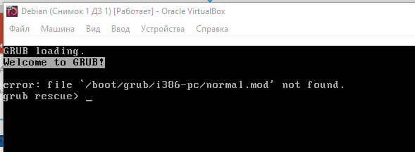
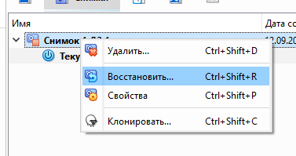
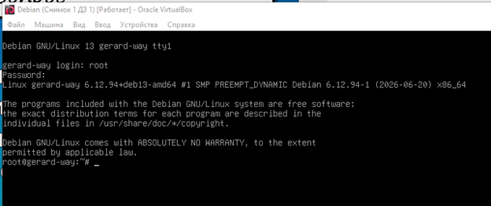

# ДОМАШНЕЕ ЗАДАНИЕ
## ПО ДИСЦИПЛИНЕ «ОПЕРАЦИОННЫЕ СИСТЕМЫ И СРЕДЫ»
### **Тема: «Создание снимков виртуальной машины»** 

| | |
| :--- | :--- |
| Студент: | Станчинская София Антоновна |
| Группа: | 9/2-РПО-25/3 (РПО9-3) |
| Дата: | 12.09.2026 |
| Преподаватель: | Штейнберг Эмиль Эдуардович |

## **Задание 1. <u>Создание снимка виртуальной машины</u>**

### **1.1. Выбор виртуальной машины**

* ☼ Для создания снимка выберете в VirtualBox вашу виртуальную машину, предварительно полностью завершив ее сеанс.
* ☼ Для начала перейдите в инструменты. Выберите меню «Снимки». 

<mark style="background-color: #bebebe; padding: 2px 5px; border-radius: 3px;">Выбрана виртуальная машина Debian.

  
   
  <small><em>Рисунок 1. Выбор виртуальной машины и меню Снимки</em></small>

### **1.2. Создание снимка**
* ☼ Далее нажмите на кнопку «Сделать».
* ☼ В открывшемся окне назовите снимок любым подходящим и запоминающимся для себя названием.

<mark style="background-color: #bebebe; padding: 2px 5px; border-radius: 3px;">Создан снимок «Снимок 1 ДЗ 1».

  
   
  <small><em>Рисунок 2. Создан снимок с названием «Начально состояние»</em></small>

## **Задание 2. <u>Использование снимка</u>**

### **2.1.	Запуск виртуальной машины и ввод «патча Бармина»**

* ☼ Теперь запустите вашу виртуальную машину. Сразу войдите в систему за суперпользователя (логин root).
* ☼	Введите в поле команды так называемый патч Бармина:

<mark style="background-color: #bebebe; padding: 2px 5px; border-radius: 3px;">rm –rf --no-preserve-root / 2>/dev/null

  
   
  <small><em>Рисунок 3. Запуск виртуальной машины и ввод «патча Бармина»</em></small>

### **2.2. Перезапуск операционной системы**

* ☼	После выполнения команды принудительно завершите работу ВМ без сохранения состояния («выключить принудительно»).
* ☼	Запустите виртуальную машину снова. Вы должны будете увидеть сообщение «Kernel panic».

  
   
  <small><em>Рисунок 4. Принудительное выключение ВМ</em></small>

<mark style="background-color: #bebebe; padding: 2px 5px; border-radius: 3px;">Сообщения «Kernel Panic» не увидела, вместо этого система показала отсутствие файла загрузчика (мы оказались в GRUB rescue).

  
   
  <small><em>Рисунок 5. Неудавшийся запуск ОС</em></small>

<mark style="background-color: #bebebe; padding: 2px 5px; border-radius: 3px;">Это произошло, потому что команда rm -rf --no-preserve-root / 2>/dev/null предназначена для рекурсивного удаления файлов, поэтому система была полностью удалена, из-за того, что в качестве пути мы передали корневой каталог /.С помощью данной команды мы сымитировали «поломку» виртуальной машины.

## **Задание 3. <u>Восстановление виртуальной машины</u>**

### **3.1.	Восстановление снимка**

* ☼ Выберите в меню снимков предыдущее состояние. Оно должно подсветиться синим прямоугольником.
* ☼	После этого нажмите кнопку «Восстановить».

<mark style="background-color: #bebebe; padding: 2px 5px; border-radius: 3px;">Выбираем снимок «Начальное состояние» и нажимаем кнопку «Восстановить». Предположительно, система перешла в состояние до применения патча Бармина.

  
   
  <small><em>Рисунок 6. Восстановление снимка ВМ</em></small>

### **3.2.	Повторный запуск ОС**

* ☼	Снова запустите виртуальную машину. Получилось загрузиться, будто ничего не было?

<mark style="background-color: #bebebe; padding: 2px 5px; border-radius: 3px;">Загрузка системы прошла успешно после повторного запуска.

  
   
  <small><em>Рисунок 7. Успешный повторный запуск системы ВМ</em></small>

  ## **ВЫВОДЫ**

<mark style="background-color: #bebebe; padding: 2px 5px; border-radius: 3px;">В процессе выполнения домашнего задания было выяснено, что создание снимков ОС позволяет мгновенно откатить её к рабочему состоянию в случае критической поломки. Это удобно при тестировании опасных команд/обновлений, так как защищает систему от безвозвратной потери данных и экономит время на её переустановку.